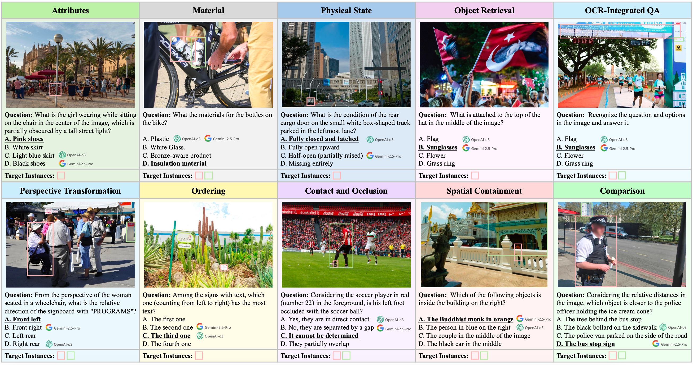

# Traceable Evidence Enhanced Visual Grounded Reasoning: Evaluation and Methodology

<p align="center">
  <a href="https://arxiv.org/abs/2507.07999">
    </a>
  <a href="https://huggingface.co/datasets/HaochenWang/TreeBench">
    </a>
  <a href="https://huggingface.co/HaochenWang/TreeVGR-7B">
    </a>
  <a href="LICENSE">
    </a>
</p>

**TL; DR**: We propose TreeBench, the first benchmark specially designed for evaluating "thinking with images" capabilities with *traceable visual evidence*, and TreeVGR, the current state-of-the-art open-source visual grounded reasoning models.

> **Abstract.** Models like OpenAI-o3 pioneer visual grounded reasoning by dynamically referencing visual regions,
> just like human "thinking with images". However, no benchmark exists to evaluate these capabilities
> holistically. To bridge this gap, we propose **TreeBench** (Traceable Evidence Evaluation Benchmark),
> a diagnostic benchmark built on three principles: (1) focused visual perception of subtle targets in
> complex scenes, (2) traceable evidence via bounding box evaluation, and (3) second-order reasoning
> to test object interactions and spatial hierarchies beyond simple object localization. Prioritizing
> images with dense objects, we initially sample 1K high-quality images from SA-1B, and incorporate
> eight LMM experts to manually annotate questions, candidate options, and answers for each
> image. After three stages of quality control, **TreeBench** consists of 405 challenging visual question-
> answering pairs, even the most advanced models struggle with this benchmark, where none of
> them reach 60% accuracy, e.g., OpenAI-o3 scores only 54.87. Furthermore, we introduce **TreeVGR**
> (Traceable Evidence Enhanced Visual Grounded Reasoning), a training paradigm to supervise
> localization and reasoning jointly with reinforcement learning, enabling accurate localizations and
> explainable reasoning pathways. Initialized from Qwen2.5-VL-7B, it improves V* Bench (+16.8),
> MME-RealWorld (+12.6), and TreeBench (+13.4), proving traceability is key to advancing visual
> grounded reasoning.



## Release

- [2025/07/12] 🔥🔥🔥 **TreeBench** and **TreeVGR** have been supported by [**VLMEvalKit**](https://github.com/open-compass/VLMEvalKit)! 🔥🔥🔥
- [2025/07/11] 🔥 **TreeBench** and **TreeVGR** have been released. Check out the [paper](https://arxiv.org/pdf/TBD) for details.


## Installation

```bash
pip3 install -r requirements.txt
pip3 install flash-attn --no-build-isolation -v
```

## Usage

This repo provides a simple local inference demo of our TreeVGR on TreeBench. First, clone this repo,
```bash
git clone https://github.com/Haochen-Wang409/TreeVGR
cd TreeVGR
```
and then, simply run inference_treebench.py
```bash
python3 inference_treebench.py
```

This should give:
```
Perception/Attributes 18/29=62.07
Perception/Material 7/13=53.85
Perception/Physical State 19/23=82.61
Perception/Object Retrieval 10/16=62.5
Perception/OCR 42/68=61.76
Reasoning/Perspective Transform 19/85=22.35
Reasoning/Ordering 20/57=35.09
Reasoning/Contact and Occlusion 25/41=60.98
Reasoning/Spatial Containment 20/29=68.97
Reasoning/Comparison 20/44=45.45
==> Overall 200/405=49.38
==> Mean IoU: 43.3
```
This result is slightly different from the paper, as we mainly utlized [**VLMEvalKit**](https://github.com/open-compass/VLMEvalKit) for a more comprehensive evaluation.

**Benchmark**
- TreeBench: https://huggingface.co/datasets/HaochenWang/TreeBench

**Checkpoints**
- TreeVGR-7B: https://huggingface.co/HaochenWang/TreeVGR-7B
- TreeVGR-7B-CI: https://huggingface.co/HaochenWang/TreeVGR-7B-CI

**Training Datasets**
- TreeVGR-RL-37K: https://huggingface.co/datasets/HaochenWang/TreeVGR-RL-37K
- TreeVGR-SFT-35K: https://huggingface.co/datasets/HaochenWang/TreeVGR-SFT-35K

## Citation

If you find Ross useful for your research and applications, please cite using this BibTeX:
```bibtex
@article{wang2025traceable,
  title={Traceable Evidence Enhanced Visual Grounded Reasoning: Evaluation and Methodology},
  author={Haochen Wang and Xiangtai Li and Zilong Huang and Anran Wang and Jiacong Wang and Tao Zhang and Jiani Zheng and Sule Bai and Zijian Kang and Jiashi Feng and Zhuochen Wang and Zhaoxiang Zhang},
  journal={arXiv preprint arXiv:2507.07999},
  year={2025}
}
```

## Acknowledgement
We would like to express our sincere appreciation to the following projects:
- [Qwen2.5-VL](https://github.com/QwenLM/Qwen2.5-VL): The base model we utilzed.
- [VGR](https://huggingface.co/datasets/BytedanceDouyinContent/VGR): The source of our SFT dataset.
- [V*](https://github.com/penghao-wu/vstar) and [VisDrone](https://github.com/VisDrone/VisDrone-Dataset): The image source of our RL dataset.
- [SA-1B](https://ai.meta.com/datasets/segment-anything/): The image source of our TreeBench.
- [LLaMA-Factory](https://github.com/hiyouga/LLaMA-Factory): The SFT codebase we utilized.
- [EasyR1](https://github.com/hiyouga/EasyR1): The RL codebase we utilized.
